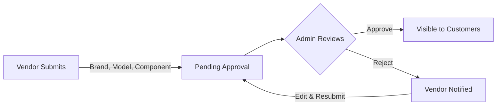

# Partify - Phone Parts E-Commerce Platform

> A comprehensive multi-tenant e-commerce platform for phone parts with vendor inventory management and admin approval workflow.

[](https://github.com/SakethKudupudi/Partify)
[](LICENSE)

## 🚀 Overview

Partify is a full-stack e-commerce platform that connects customers with phone parts vendors through an admin-moderated marketplace. The platform features three distinct portals (Admin, Vendor, Customer) with a complete inventory request and approval system.

### Key Features

- **🔐 Role-Based Access Control** - Admin, Vendor, and Customer portals
- **✅ Vendor Inventory Approval** - Admin-moderated component listings
- **📱 Phone Model Management** - Comprehensive model and component catalog
- **🛒 Shopping Cart** - Redis-powered cart with real-time updates
- **💰 Multi-Vendor Pricing** - Compare prices from different vendors
- **☁️ Azure Blob Storage** - Product image management
- **🗄️ Supabase Backend** - PostgreSQL database with real-time subscriptions

## 📋 Table of Contents

- [Tech Stack](#tech-stack)
- [Project Structure](#project-structure)
- [Getting Started](#getting-started)
- [Features](#features)
- [API Documentation](#api-documentation)
- [Database Schema](#database-schema)
- [Deployment](#deployment)
- [Contributing](#contributing)

## 🛠 Tech Stack

### Frontend
- **React 18.2** - UI library
- **Vite 5.0** - Build tool
- **React Router v6** - Client-side routing
- **React Hot Toast** - Notifications

### Backend
- **Node.js & Express** - REST API server
- **Supabase** - PostgreSQL database & authentication
- **Redis** - Session management & caching
- **Azure Blob Storage** - Image hosting
- **JWT** - Token-based authentication

### DevOps
- **Terraform** - Infrastructure as Code
- **Azure** - Cloud hosting
- **Docker** - Containerization (optional)

## 📁 Project Structure

```
partify/
├── backend/                    # Express API server
│   ├── config/                 # Database & cloud configs
│   ├── middleware/             # Auth & validation
│   ├── routes/                 # API endpoints
│   └── server.js               # Entry point
├── unified-portal/             # Main React application
│   └── src/
│       ├── pages/
│       │   ├── admin/          # Admin dashboard
│       │   ├── vendor/         # Vendor dashboard
│       │   └── customer/       # Customer storefront
│       └── components/         # Shared components
├── database/                   # SQL schemas & seeds
├── terraform/                  # Infrastructure configs
└── docs/                       # Documentation
```

## 🚦 Getting Started

### Prerequisites

- Node.js 18+ and npm
- Supabase account
- Azure account (for blob storage)
- Redis instance

### Environment Setup

1. **Clone the repository**
   ```bash
   git clone https://github.com/SakethKudupudi/Partify.git
   cd partify
   ```

2. **Install dependencies**
   ```bash
   # Backend
   cd backend
   npm install

   # Frontend
   cd ../unified-portal
   npm install
   ```

3. **Configure environment variables**

   Create `.env` files in both `backend/` and `unified-portal/`:

   **backend/.env**
   ```env
   # Supabase
   SUPABASE_URL=your_supabase_url
   SUPABASE_ANON_KEY=your_supabase_anon_key
   SUPABASE_SERVICE_ROLE_KEY=your_service_role_key

   # Azure Blob Storage
   AZURE_STORAGE_ACCOUNT_NAME=your_storage_account
   AZURE_STORAGE_ACCOUNT_KEY=your_storage_key
   AZURE_STORAGE_CONTAINER_NAME=product-images

   # Redis
   REDIS_HOST=localhost
   REDIS_PORT=6379
   REDIS_PASSWORD=your_redis_password

   # JWT
   JWT_SECRET=your_jwt_secret

   # Server
   PORT=8080
   NODE_ENV=development
   ```

4. **Set up the database**
   ```bash
   # Run schema
   psql -h your-db-host -U postgres -d your-db -f database/schema.sql

   # Seed initial data
   psql -h your-db-host -U postgres -d your-db -f database/seed-users.sql
   ```

5. **Start the development servers**

   ```bash
   # Backend (Terminal 1)
   cd backend
   npm run dev

   # Frontend (Terminal 2)
   cd unified-portal
   npm run dev
   ```

6. **Access the application**
   - Frontend: http://localhost:3001
   - Backend API: http://localhost:8080

### Default Users

After seeding, you can log in with:

- **Admin**: admin@partify.com / admin123
- **Vendor**: vendor@partify.com / vendor123
- **Customer**: customer@partify.com / customer123

## ✨ Features

### Admin Portal (`/admin`)

- **Dashboard** - Overview of platform metrics
- **Brand Management** - Add/edit/delete phone brands
- **Model Management** - Manage phone models with images
- **Component Management** - Configure components per model
- **Vendor Requests** - Approve/reject vendor inventory
- **Sales Analytics** - Revenue and order tracking

### Vendor Portal (`/vendor`)

- **Dashboard** - Inventory and sales overview
- **Inventory Management** - Submit component requests
  - Cascading selection: Brand → Model → Component
  - Set quantity and proposed pricing
  - Edit pending requests
- **Request Tracking** - Monitor approval status
- **Sales Reports** - Track revenue and orders

### Customer Portal (`/`)

- **Browse Brands** - Explore phone manufacturers
- **View Models** - Detailed phone specifications
- **Component Catalog** - See available parts
- **Vendor Comparison** - Compare prices from multiple vendors
- **Shopping Cart** - Add to cart and checkout
- **Order History** - Track past purchases

## 🔄 Vendor Inventory Workflow



1. **Vendor submits inventory request**
   - Selects brand, then model, then component
   - Sets quantity and proposed price
   - Status: `pending_approval`

2. **Admin reviews request**
   - Views vendor details, component info, pricing
   - Can approve or reject with reason

3. **Customer sees approved items**
   - Only approved components visible
   - Shows vendor pricing and stock
   - Can compare multiple vendors

## 📡 API Documentation

### Base URL
```
http://localhost:8080/api
```

### Authentication
All protected endpoints require JWT token in Authorization header:
```
Authorization: Bearer <token>
```

### Key Endpoints

#### Authentication
```bash
POST   /api/auth/login          # Login
POST   /api/auth/register       # Register new user
POST   /api/auth/logout         # Logout
```

#### Admin API
```bash
GET    /api/admin/brands        # List all brands
POST   /api/admin/brands        # Create brand
PUT    /api/admin/brands/:id    # Update brand
DELETE /api/admin/brands/:id    # Delete brand

GET    /api/admin/models        # List all models
POST   /api/admin/models        # Create model
PUT    /api/admin/models/:id    # Update model

GET    /api/vendor-requests                  # List all requests
GET    /api/vendor-requests?status=pending   # Filter by status
POST   /api/vendor-requests/:id/approve      # Approve request
POST   /api/vendor-requests/:id/reject       # Reject request
```

#### Vendor API
```bash
GET    /api/vendor/inventory       # List vendor inventory
POST   /api/vendor/inventory       # Submit new request
PUT    /api/vendor/inventory/:id   # Update request
DELETE /api/vendor/inventory/:id   # Delete request
```

#### Customer API
```bash
GET    /api/customer/brands                   # List brands
GET    /api/customer/brands/:id/models        # Models by brand
GET    /api/customer/models/:id/components    # Components with pricing
GET    /api/customer/cart                     # Get cart
POST   /api/customer/cart/add                 # Add to cart
```

For complete API documentation, see [API_REFERENCE.md](API_REFERENCE.md)

## 🗄️ Database Schema

### Core Tables

- **users** - User accounts (admin, vendor, customer)
- **brands** - Phone manufacturers (Apple, Samsung, etc.)
- **phone_models** - Specific phone models
- **components** - Replacement parts catalog
- **phone_model_components** - Components available per model
- **vendors** - Vendor profiles
- **vendor_inventory** - Vendor inventory with approval status
- **orders** - Customer orders
- **order_items** - Order line items

For complete schema, see [database/schema.sql](database/schema.sql)

## 🚀 Deployment

### Using Terraform (Azure)

1. **Configure Terraform variables**
   ```bash
   cd terraform
   cp terraform.tfvars.example terraform.tfvars
   # Edit terraform.tfvars with your values
   ```

2. **Deploy infrastructure**
   ```bash
   terraform init
   terraform plan
   terraform apply
   ```

3. **Deploy application**
   ```bash
   ./deploy.sh
   ```

### Manual Deployment

See [DEPLOYMENT.md](DEPLOYMENT.md) for detailed deployment instructions.

## 🧪 Testing

```bash
# Run backend tests
cd backend
npm test

# Run frontend tests
cd unified-portal
npm test

# Run E2E tests
npm run test:e2e
```

## 🤝 Contributing

Contributions are welcome! Please follow these steps:

1. Fork the repository
2. Create a feature branch (`git checkout -b feature/AmazingFeature`)
3. Commit your changes (`git commit -m 'Add some AmazingFeature'`)
4. Push to the branch (`git push origin feature/AmazingFeature`)
5. Open a Pull Request

## 📄 License

This project is licensed under the MIT License - see the [LICENSE](LICENSE) file for details.

## 👥 Authors

- **Saketh Kudupudi** - [@SakethKudupudi](https://github.com/SakethKudupudi)

## 🙏 Acknowledgments

- Built with [Supabase](https://supabase.com)
- Hosted on [Azure](https://azure.microsoft.com)
- UI inspired by Apple's design language

## 📞 Support

For support, email [support@partify.com](mailto:support@partify.com) or open an issue.

---

**⭐ Star this repo if you find it helpful!**
